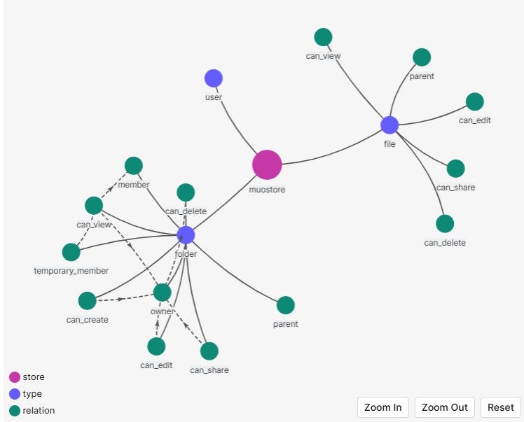
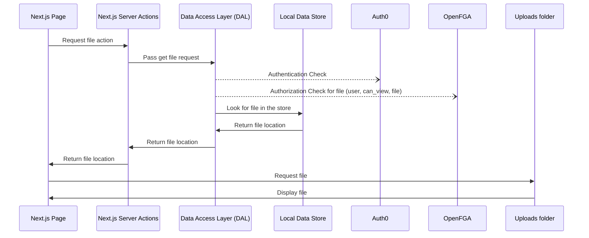
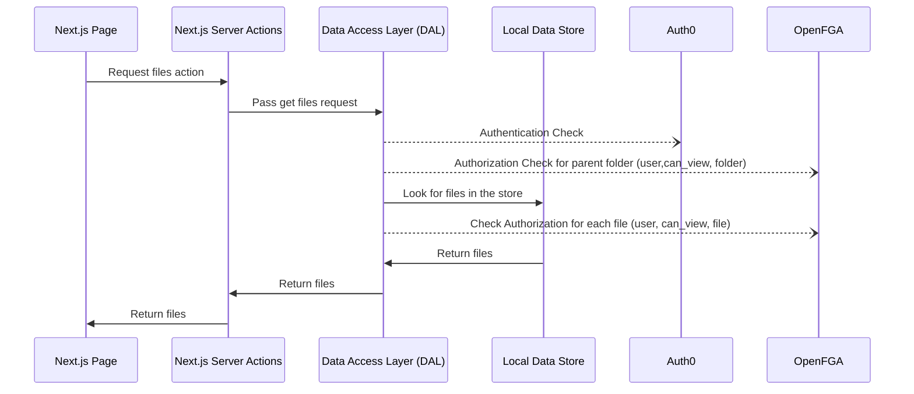
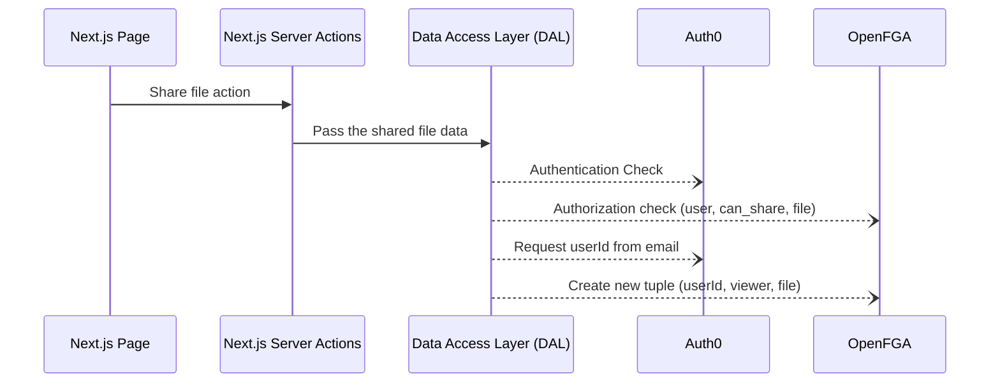

# Muo Drive — Modular File & Folder Management with Fine-Grained Access Control

Muo Drive is a project born from a technical challenge, evolving into a fully modular drive system with rich access control, SSR/CSR optimizations, and observability.

It aims to teach the basics of how to use OpenFGA to handle Fine Grained Authorization (FGA) on a per-resource level.

Users can log in, create folders and files, and securely share them with other users by email. Shared items appear in the recipient’s interface, respecting access rules defined via OpenFGA. The project emphasizes a modern SSR/CSR architecture, composable authorization logic

## Tech Stack

### In Use

| Stack Area         | Tech/Tool                      | Purpose                         |
| ------------------ | ------------------------------ | ------------------------------- |
| **Framework**      | Next.js (App Router, React 18) | SSR/CSR hybrid app structure    |
| **Language**       | TypeScript                     | Type safety                     |
| **Styling**        | Tailwind CSS                   | Utility-first responsive design |
| **Auth**           | Auth0                          | Secure authentication           |
| **Access Control** | Okta FGA                       | Hosted and managed FGA          |
| **Deployment**     | Vercel                         | Hosting with SSR support        |

**Note:** The project is not using a database for storing files and folders.
It is using a local data store as `folders.json` in the `store` folder.

### Planned

| Stack Area        | Tech/Tool             | Purpose                                |
| ----------------- | --------------------- | -------------------------------------- |
| **State & Data**  | React Query           | Asynchronous data handling and caching |
| **Validation**    | Zod + React Hook Form | Form validation                        |
| **Observability** | OpenTelemetry         | Tracing and frontend metrics           |
| **Testing**       | Vitest / Jest         | Unit and integration tests             |
| **Database**      | Postgres              | Database for storing files and folders |
| **Cache**         | Redis                 | Cache for storing files and folders    |

## Current Features

- User authentication with Auth0
- Folder and file creation
- Sharing folders and files via email
- Viewing shared folders and files
- Permission-based access logic using OpenFGA
- Folder-level permission inheritance
- SSR/CSR hybrid rendering with Next.js App Router
- Modular and extensible component structure

## Local Development

### 1. Clone the repository

```bash
git clone https://github.com/muhammedoguz/muo-drive.git
```

### 2. Install dependencies

```bash
npm install
```

### 3. Configure environment variables

Create a `.env` file:

```bash
cp .env.sample .env
```

Fill in the missing environment variables.
Sample contains how to obtain the values for the environment variables.

### 4. Run the application

```bash
npm run dev
```

## Demo


### Credentials

This user has some data in the database:

- email: `test@example.com`
- password: `Muodrive123`

This user has some data as shared from the other user:

- email: `shared@example.com`
- password: `Muodrive123`

## OpenFGA Model



The application currently does not implement all functionality, like editing or deleting files and folders. This might be added in the future.

```
model
  schema 1.1

type user

type folder
  relations
    define parent: [folder]

    define owner: [user]
    define temp_user: [user] # shared_view

    define can_create: owner or can_create from parent
    define can_delete: owner or can_delete from parent
    define can_edit: owner or can_edit from parent
    define can_share: owner or can_share from parent
    define can_view: owner or temp_user or can_view from parent


type file
  relations
    define parent: [folder]
    define owner: [user]
    define temp_user: [user]

    define can_delete: owner or can_delete from parent
    define can_edit: owner or can_edit from parent
    define can_share: owner or can_share from parent
    define can_view: owner or temp_user or can_view from parent
```

### OpenFGA / Okta FGA checks

The application does the following OpenFGA / Okta FGA checks:

#### Files

- Requesting a file:
  - Check if the current user has a `can_view` relationship to a file.
- Requesting all files for a folder:
  - Check if the current user has a `can_view` relationship to a folder.
  - Check for a `can_view` relationship for all files.
- Uploading a file:
  - Check for a `can_create` relationship to the parent folder.
  - Once uploaded:
    - Write a tuple setting the user as the `owner` of the new file.
    - Write a tuple setting the parent folder as the `parent` of the new file.
- Sharing a file:
  - Check if the current user has a `can_share` relationship with the file.
  - Write a tuple setting the user we shared the file with as a `temp_user` of the file.

#### Folders

- Requesting a folder:
  - Check if the current user has a `can_view` relationship to the folder.
- Requesting all folders for a parent folder:
  - Check if the current user has a `can_view` relationship to the parent folder.
  - Check for a `can_view` relationship with all folders withing the parent.
- Creating a new folder:
  - Once created:
    - Write a new tuple setting the current user as its `owner`.
- Sharing a folder:
  - Check if the current user `can_share` the folder.
  - Write a tuple setting the new user as a `temp_user`.

## Missing Features

- Temporary access support (time-limited permissions)
- Real-time permission revocation and UI updates
  - Can be implemented polling (easy) or using a websocket (harder)
- Observability integration (OpenTelemetry, logging)
- Admin panel for managing FGA relationships
- Test coverage for access control and UI states

## Architecture

### Get a file



### Get files for folder



### Share a file


